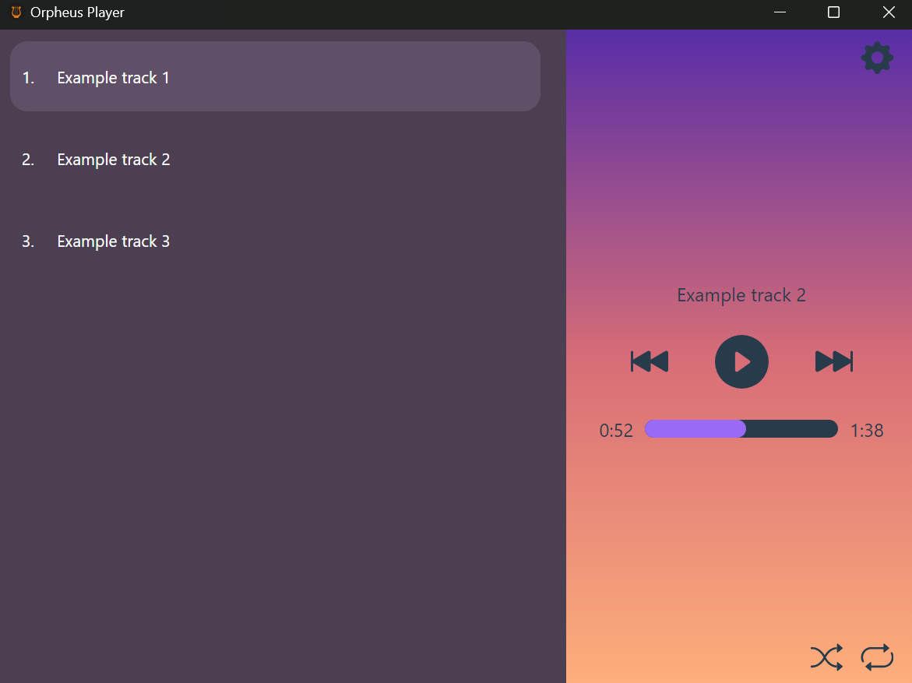
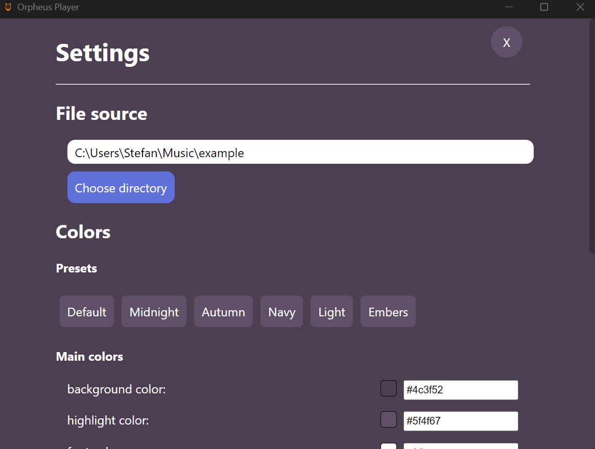
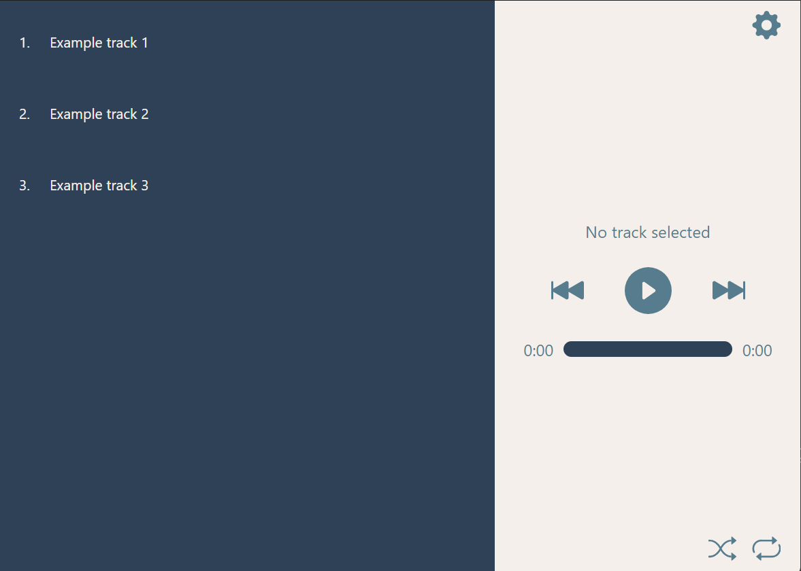

# Orpheus audio player

## What is this?
This is an audio player made with Electron that puts emphasis on being customizable.

Supported file formats:
* mp3
* wav (untested)
* ogg (untested)

## What features does it have?
It supports all standard playback options like shuffle, loop, skip, etc. All UI colors are modifiable through the in-app settings and there are several color presets available.

## Screenshots

## Possible future developments
* external audio sources
* support for multiple audio sources
* support for file tags
* search, sort, filtering for tracks
* changing UI layout through settings (this probably wont happen)